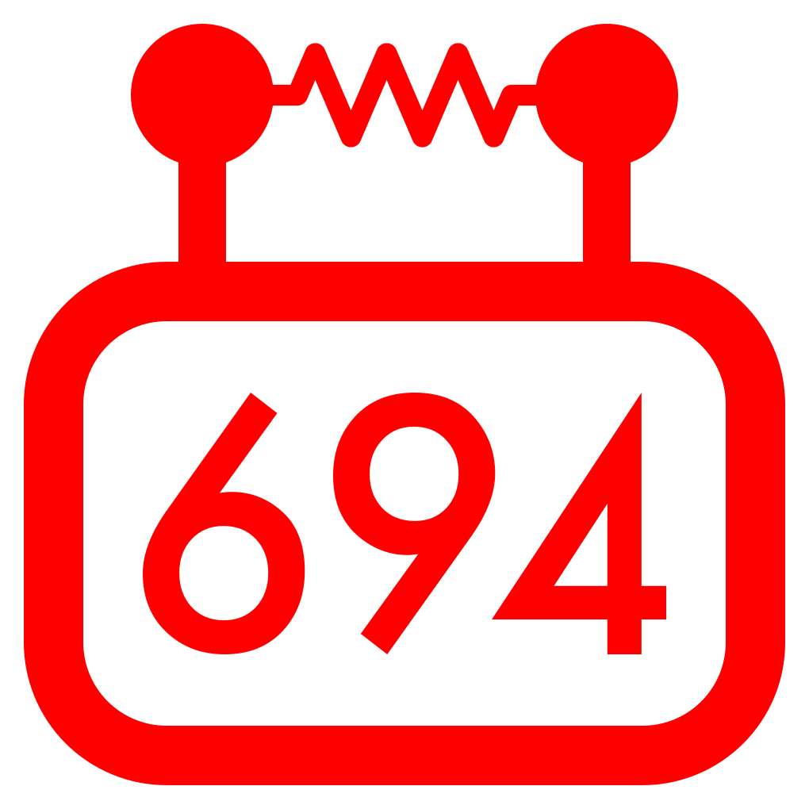
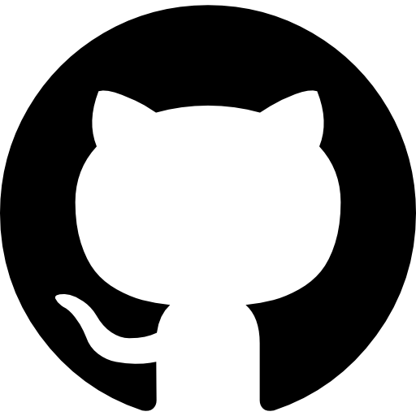
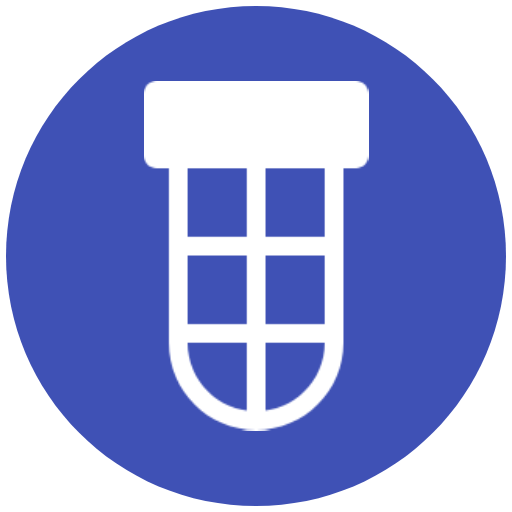

# Hello 👋
# 👋 [SALAMALIKUM ALIKUMSALAMMMMMM](https://www.youtube.com/shorts/oxpmOP96sMo?feature=share)
# হ্যালো👋
---

I'm Faizaan, a Freshman at Stuyvesant High School.

I currently specialize in [robotics programming](https://github.com/StuyPulse/StuyPlus-2026), [system automation/abstraction and tooling](https://github.com/Faizaan-J/mine-strapper), and a bit of [game development](https://github.com/FarhanJ2/the-road-not-taken) and front-end development on the side.
 
I'm currently focusing my work at the award winning FRC Team 694, [StuyPulse](https://stuypulse.com).

## Technologies

### Languages
| Javascript/Typescript                                                                                                                                                                                         | Python                                                                                         | Java                                                                                       | Kotlin                                                                                         | C#                                                                                             | C++                                                                                                  | Lua                                                                                      |
|:-------------------------------------------------------------------------------------------------------------------------------------------------------------------------------------------------------------:|:----------------------------------------------------------------------------------------------:|:------------------------------------------------------------------------------------------:|:----------------------------------------------------------------------------------------------:|:----------------------------------------------------------------------------------------------:|:----------------------------------------------------------------------------------------------------:|:----------------------------------------------------------------------------------------:|
|   |  |  |  |  |  |  |

### Frameworks/Libraries and Tools

| React                                                                                                                      | Redux                                                                                                                    | Angular                                                                                                                        | NodeJS/NPM                                                                                                                                                                                                                                                      | Android Studio                                                                                                                                    | Electron                                                                                                                          | Flask                                                                                                                    | Expo                                                                                                                           |
|:--------------------------------------------------------------------------------------------------------------------------:|:------------------------------------------------------------------------------------------------------------------------:|:------------------------------------------------------------------------------------------------------------------------------:|:---------------------------------------------------------------------------------------------------------------------------------------------------------------------------------------------------------------------------------------------------------------:|:-------------------------------------------------------------------------------------------------------------------------------------------------:|:---------------------------------------------------------------------------------------------------------------------------------:|:------------------------------------------------------------------------------------------------------------------------:|:------------------------------------------------------------------------------------------------------------------------------:|
|  |  |  |   |  |  | <picture><source media="(prefers-color-scheme: dark)" srcset="./assets/flask/flask-dark-mode.svg"><source media="(prefers-color-scheme: light)" srcset="./assets/flask/flask-light-mode.svg"></picture> | <picture><source media="(prefers-color-scheme: dark)" srcset="./assets/expo/expo-dark-mode.svg"><source media="(prefers-color-scheme: light)" srcset="./assets/expo/expo-light-mode.svg"></picture> |

| Unity                                                                                                                    | Roblox Studio                                                                                                              |
|:------------------------------------------------------------------------------------------------------------------------:|:--------------------------------------------------------------------------------------------------------------------------:|
|  |  |
